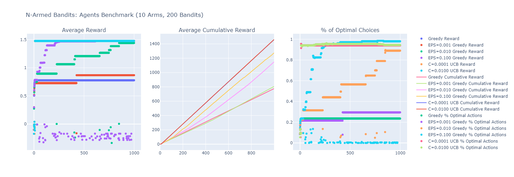
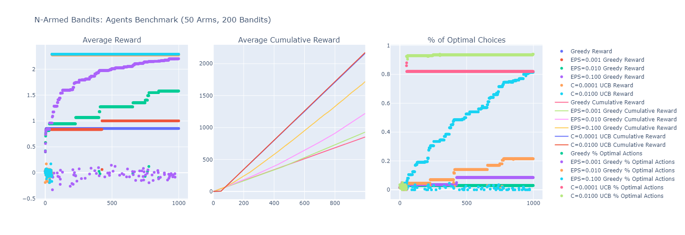
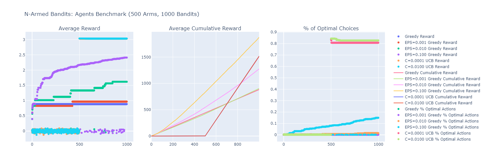

# Multiarmed Bandits

This is a vanilla problem in game theory, known to have several real-world applications like news selection in social media apps which are based on feed like YouTube or TikTok. Recently I came across it in the context of Reinforcement Learning.
There are many ways to solve it, including most widely-known Epsilon-Greedy approach and Upper Confidence Bound.

I played with the bandits for a while and noticed interesting patterns in the performance of the mentioned agents:

+ Firstly, the problem I considered was stationary, i.e. the weights of actions did not change over time (however, I added a little noise term to the reward)

+ Basic Greedy agent quickly finds suboptimal solution but is dramastically outperformed by other models! The reason is simple as greedy agents do not explore at all thus are locked in local minima.

+ $\epsilon$-greedy models are capable of holding balance between exploration and exploitation. The higher $\epsilon$ one picks, the faster the model will outperform greedy algorithm. Hovewer, have a look at the plots below: I tried fitting same models on problems of different size. Remarkably, the performance of this family of algorithms does not suffer from the curse of dimensionality: the slopes are almost identical for `10`, `50` and `500` arms. However, the downside is that these models have no idea of stopping thus there will be attempts to improve the score even when the solution is already near-optimal. Guess that means that such models do converge in the limit. Of course, this would imvolve huge number of iterations, one can even approximate this number at ease :)

+ Upper Confidence Bound models are aggresively exploring the space of possible actions, but that may be due to my implementation which implies exploring until each action was picked at least once. This may be useful in non-stationary problems and the models do not basically try out actions which are not optimal after exploration. The problem is this is basically brute-forcing action space and requires number of iterations equal to the problem dimensionality. In real-world problems such approach is insufficient (see plot corresponding to 500-armed bandit: the agents were looking for the best action for almost half of iterations, eventually losing to $\epsilon$-models in terms of cumulative reward)

# Plots

